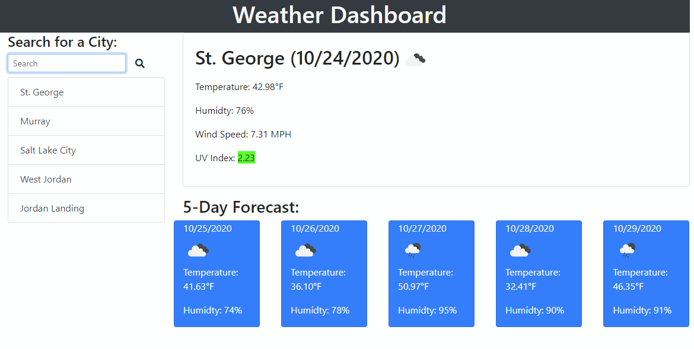

# 06 Server-Side APIs: Weather Dashboard

This allows users to search a city and get the current information along with a 5 day forecast. When they search a city it adds it to a list of cities that is saved so when the page is loaded the last city's information is automatically pulled up

## View yourself

[Weather Dashboard](https://heavensregent.github.io/nb-w6-homework/)
